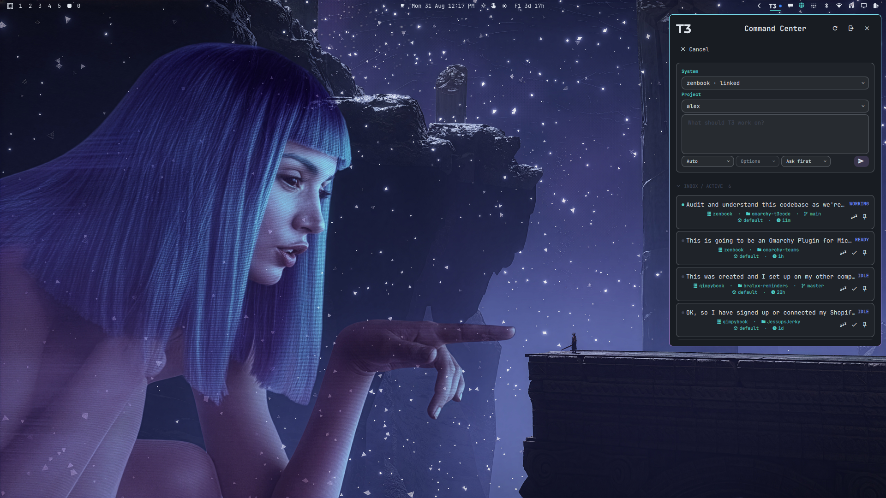
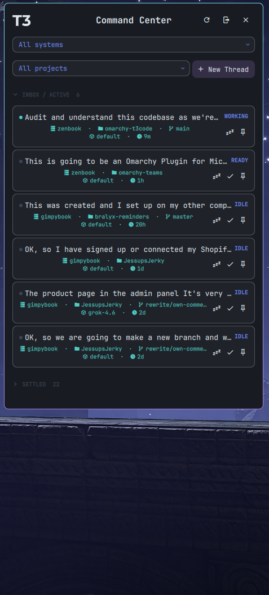
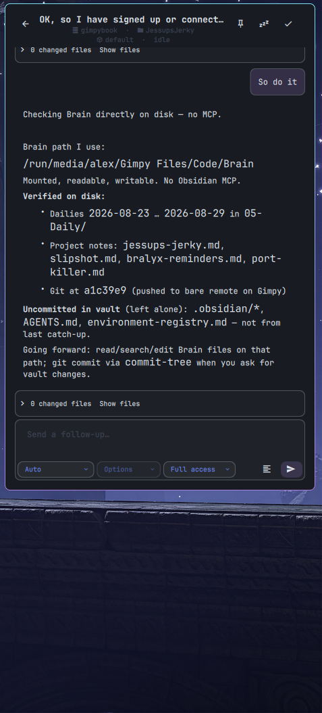
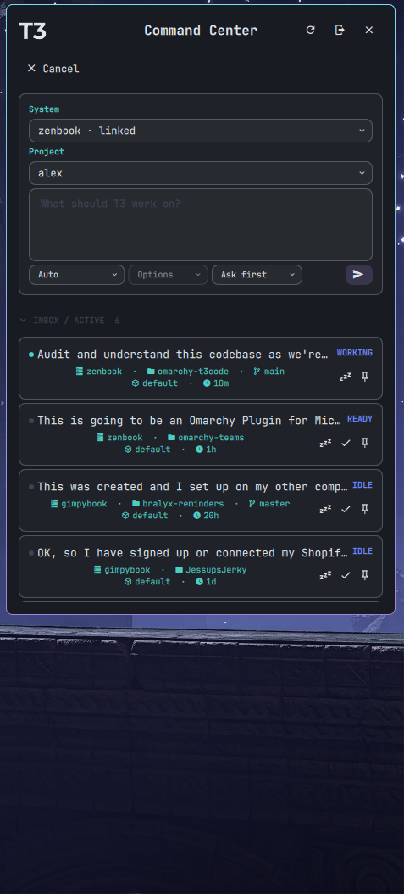
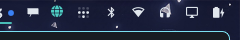

# T3 Command Center

Compact native [Omarchy](https://omarchy.org/) / Quickshell client for
[T3 Code](https://t3.gg/) — Inbox and threads without the full desktop app.

Published by **Bralyx Digital** as `bralyx.t3code`.



## Screenshots

| Inbox | Thread | New thread |
| --- | --- | --- |
|  |  |  |

Bar widget (T3 mark + status color):



## What it does

- Native Clerk browser sign-in with T3's `t3-relay` JWT, loopback callback
  handoff, and automatic Inbox summon
- Merged Inbox across linked systems, with system and project filters
- Streamed threads, approvals, user input, screenshot paste, lifecycle
  commands (settle / snooze / pin), and model / runtime controls
- One typed TypeScript bridge as a shell child; QML is presentation only —
  no embedded browser, terminal, editor, or Git UI

Pinned T3 Nightly: `v0.0.34-nightly.20260822.1160`
(`2c4158f87a1b6a586d0aa5e0338f122cb7887c4f`). Exact source lives in
`upstream/t3code` and `t3-upstream.lock.json`.

## Install

```bash
omarchy plugin add https://github.com/GimpyHand/omarchy-t3code.git --enable
```

Omarchy warns that plugins run unsandboxed, clones this repo, validates the
manifest, and enables the plugin. No Node or pnpm needed at runtime.

```bash
omarchy plugin update bralyx.t3code
omarchy bar put bralyx.t3code --section right --index 0
```

Or use a release archive:

```bash
tar -xzf omarchy-t3code-plugin.tar.gz
./install
```

Click the T3 mark → **Sign in with T3 Connect**. The browser callback returns
you to Inbox.

## Requirements

- Omarchy 4.0+ (x86-64) with Quickshell plugins and `wl-paste`
- Secret Service + `secret-tool`
- `xdg-open`, `xdg-mime`, `gzip`, `sha256sum`, graphical browser

Other Linux arches can build a native bridge from source.

## Uninstall

From an installed checkout:

```bash
~/.config/omarchy/plugins/bralyx.t3code/uninstall
```

From a release archive (same directory as `install`):

```bash
./uninstall
```

Add `--keep-secrets` to retain the Clerk session and DPoP identity.

## Development

```bash
pnpm check          # validate + typecheck + tests + QML + build
pnpm deploy:plugin  # build and copy into ~/.config/omarchy/plugins/
```

See [CONTRIBUTING.md](CONTRIBUTING.md), [ARCHITECTURE.md](ARCHITECTURE.md),
[SECURITY.md](SECURITY.md), and [docs/ACCEPTANCE.md](docs/ACCEPTANCE.md).

## License

MIT. Third-party notices and the Node runtime inventory live in
[THIRD_PARTY_NOTICES.md](THIRD_PARTY_NOTICES.md) and [licenses/](licenses/).
